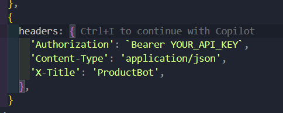
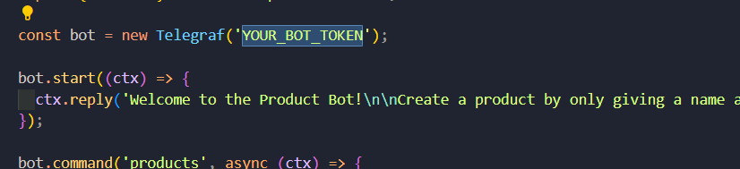

# 🧠 Atex Product Catalog Microservices System

A simple and extendable microservices-based product catalog project. Users can manage products through a REST API or Telegram Bot. Product descriptions are generated automatically using a free AI model.

---

## 📦 Stack

- **Node.js + TypeScript**
- **Fastify** — REST API
- **Telegraf** — Telegram Bot
- **Drizzle ORM** — PostgreSQL integration
- **PostgreSQL** — Product storage
- **Redis** — Caching layer
- **NATS** — Message broker for microservice communication
- **Turborepo** — Monorepo structure
- **OpenRouter + Mistral AI** — Free model for generating product descriptions

---

## ⚙️ Services Overview

### 1. `product-api`

> Acts as the gateway for clients via REST & Telegram

- Handles validation and NATS messaging
- Sends product operations to `product-crud`
- Responds back to client (Postman or Bot)

### 2. `product-crud`

> Handles all business logic and database access

- Listens to NATS messages for CRUD operations
- Reads/writes from PostgreSQL
- Uses Redis for caching reads

### 3. `telegram-bot`

> User-facing Telegram bot

- Accepts `/start`, `/products`, `/product`, `/create`, `/update`, `/delete` commands
- Sends operations to `product-api`
- Uses AI to generate product descriptions automatically based on the name

---

## 🛠 How to Run

### 1. Clone the repository

```bash
git clone https://github.com/Xayrulloh/ATEX.git && cd ATEX
```

### 2. YOUR_API_KEY

> You can obtain your API key from [OpenRouter](https://openrouter.ai/)

- take your api key and put it inside ./shared/utils/ai.ts
  

### 3. YOUR_BOT_TOKEN

> You can obtain your bot token from [Telegram](https://t.me/BotFather)

- take your bot token and put it inside ./apps/telegram-bot/src/bot.ts
  

### 3. Docker Compose

```bash
docker compose up --build
```

## Test via Telegram

1. Go to your bot
2. Available commands: `/start`, `/products`, `/product <id>`, `/create <name>`, `/update <id> <name>`, `/delete <id>`

When creating a product, the bot will automatically generate a description using AI.

## 🤯 How It Works

- telegram-bot interacts with users and forwards everything to product-api
- product-api sends NATS request like product.create
- product-crud receives the message, handles DB, and returns result
- AI description is generated using Mistral-7B-Instruct model from OpenRouter

## ✅ No .env Required

- All tokens and keys are hardcoded for simplicity in this test task
- No external configuration needed
